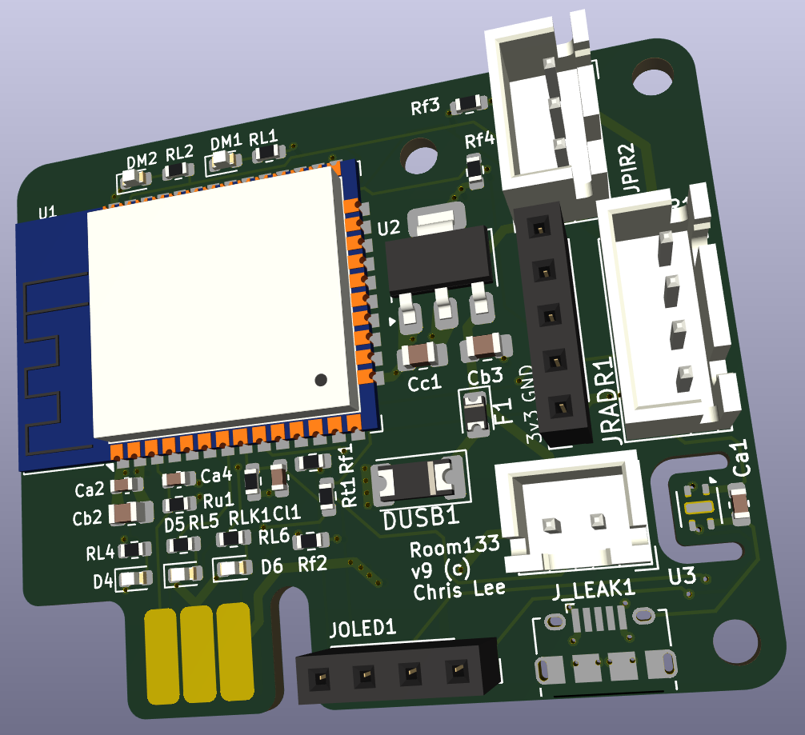

# Room133

Room133 is an ESP32-based device which helps with various room-monitoring tasks in a house, for use with [Home Assistant](https://www.home-assistant.io/).

It is based on the [og3](https://github.com/chl33/og3) C++ software framework for ESP devices.

## KiCAD

This project contains KiCAD sources for the Room133 circuit board.  It requires the [chl33_kicad_sym](https://github.com/chl33/chl33_kicad_sym) library.  I'm not experienced with sharing KiCAD projects in github.  I expect you will need to fix some path names if you try to open this project in KiCAD.
