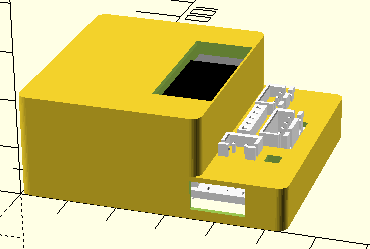

# Room133

Room133 is an ESP32-based family of which helps with various room-monitoring tasks in a house, for use with [Home Assistant](https://www.home-assistant.io/).  It can
- Monitor temperature and humidity in different rooms.
- Measure light level in different rooms and detects motion/presence in those rooms for
   lighting control,
- Check for standing water.
- Monitor the water level of a boiler.
- Act as a Bluetooth extenders for the Home Assistant[^HomeAssistant].

It is based on the [og3](https://github.com/chl33/og3) C++ software framework for ESP devices.

This repository includes software for the device, KiCAD files for the circuit board, and OpenSCAD files for creating the project boxes for the different devices.

Please see the [write-up](https://selectiveappeal.org/posts/room133/) on the project in my blog.  I also [wrote about](https://selectiveappeal.org/posts/room133-box/) the EBox design included in this repository.

## PCBA design: KiCAD

This project contains KiCAD sources for the Room133 circuit board.  It requires the [chl33_kicad_sym](https://github.com/chl33/chl33_kicad_sym) library.  I'm not experienced with sharing KiCAD projects in github.  I expect you will need to fix some path names if you try to open this project in KiCAD.

## EBox design: OpenSCAD

This project contains OpenSCAD sources for 3D-printing EBoxes for Room133 devices.  They use the library in [ProjectBox](https://github.com/chl33/ProjectBox).

You can open [`Ebox/Room133_test.scad`](Ebox/Room133_test.scad) with OpenSCAD and run [`Ebox/gui.sh`](Ebox/gui.sh), and use the user interface to customize the box depending on the application

.

I slice my EBox models with PrusaSlicer and print them in PETG.

