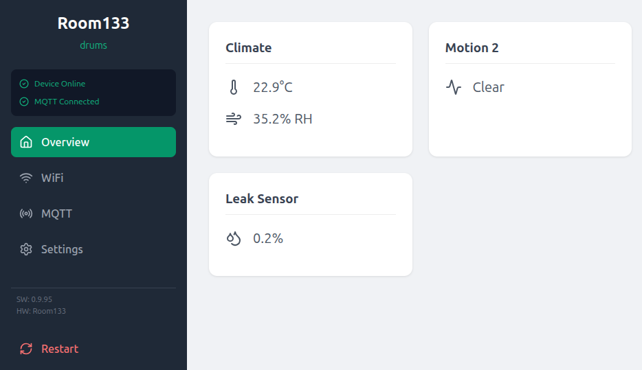
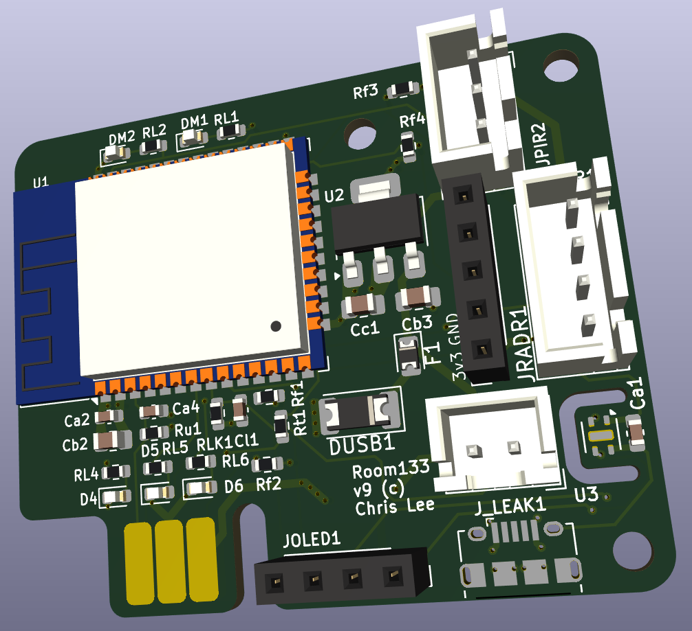
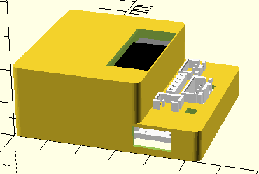

# Room133 (v1.0.0)

Room133 is an ESP32-based family of devices which helps with various room-monitoring tasks, particulary for use with [Home Assistant](https://www.home-assistant.io/).

## Features
- **Adaptive Web Interface:** A modern, responsive Svelte UI that automatically detects and displays only the hardware capabilities active on your specific board (Motion, Light, Leak, OLED).
- **Climate Monitoring:** SHTC3-based temperature and humidity tracking.
- **Motion & Presence:** Support for one or more PIR sensors.
- **Environmental Sensing:** Light level measurement and standing water (leak) detection.
- **Unified Configuration:** Standardized JSON API and a clean settings interface for tuning filters and thresholds.
- **Robust Networking:** Automatic captive portal for WiFi setup and auto-reboot on configuration changes.
- **OTA Updates:** Reliable wireless firmware updates (requires `min_spiffs.csv` partition layout).

It is based on the [og3](https://github.com/chl33/og3) C++ software framework.

This repository includes software for the device, KiCAD files for the circuit board, and OpenSCAD files for creating the project boxes for the different devices.

Please see the [write-up](https://selectiveappeal.org/posts/room133/) on the project in my blog.  I also [wrote about](https://selectiveappeal.org/posts/room133-box/) the EBox design included in this repository.

## PCBA design: KiCAD

This project contains KiCAD sources for the Room133 circuit board.  It requires the [chl33_kicad_sym](https://github.com/chl33/chl33_kicad_sym) library.  I'm not experienced with sharing KiCAD projects in github.  I expect you will need to fix some path names if you try to open this project in KiCAD.

## EBox design: OpenSCAD

This project contains OpenSCAD sources for 3D-printing EBoxes for Room133 devices.  They use the library in [ProjectBox](https://github.com/chl33/ProjectBox).

You can open [`Ebox/Room133_test.scad`](Ebox/Room133_test.scad) with OpenSCAD and run [`Ebox/gui.sh`](Ebox/gui.sh), and use the user interface to customize the box depending on the application

.

I slice my EBox models with PrusaSlicer and print them in PETG.

## Wires

### PIR wire

JST socket 3x1

| Pin 1 | Pin2 | Pin 3  |
|:------|:-----|:-------|
| +5V   | GND  | Motion |

to

Dupont socket 3x1

| Pin 1 | Pin2 |  Pin 3  |
|:------|:------|:-------|
| +5V   | Motion| GND    |
